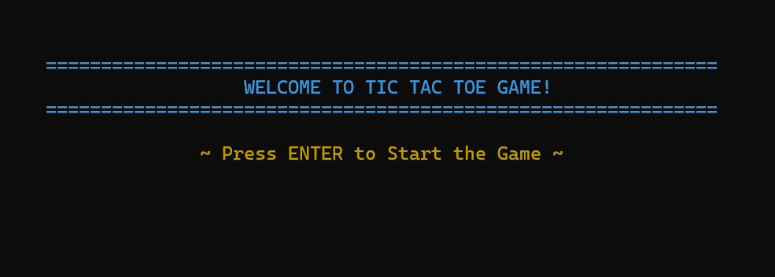
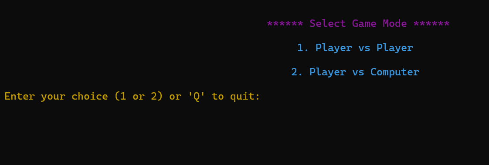
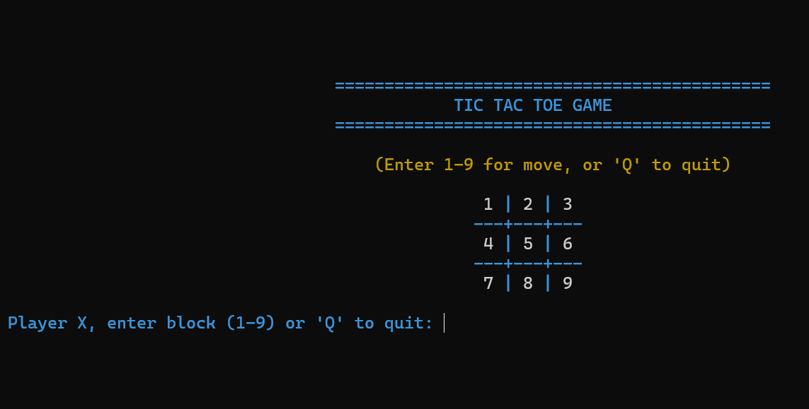
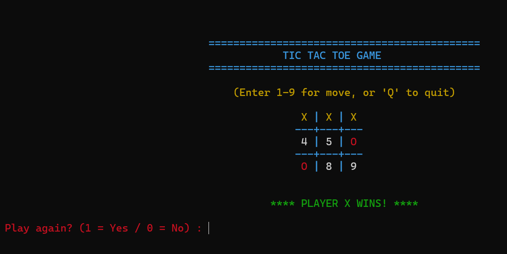

# tictactoe
# Tic Tac Toe Game

## Description
A simple Tic Tac Toe game built to be played on the command line using the C programming language.

## Features
- Two-player mode
- Player vs Computer mode
- Win detection
- Clean UI

## Screenshots

### Game Start

### Gameplay

### Win Screen

